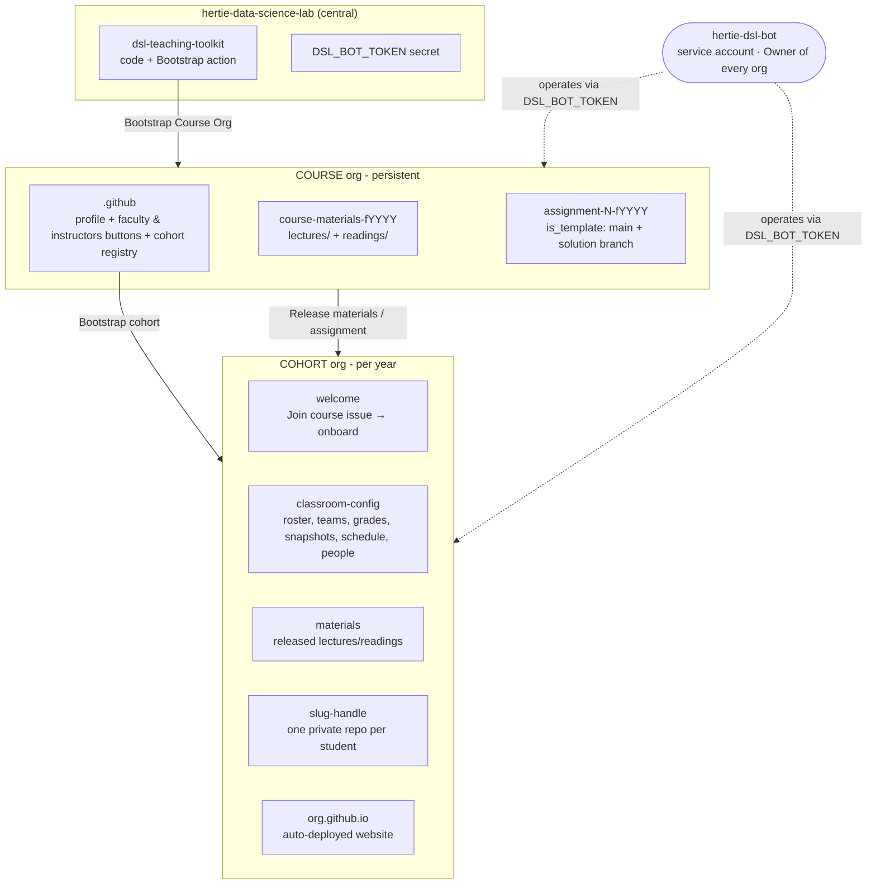
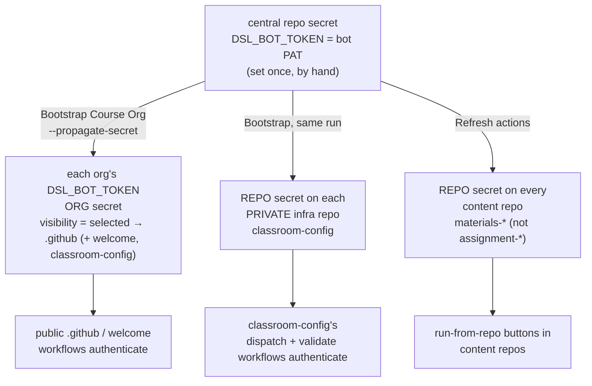
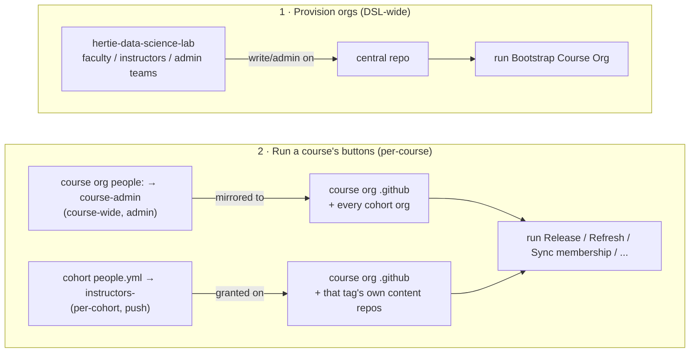
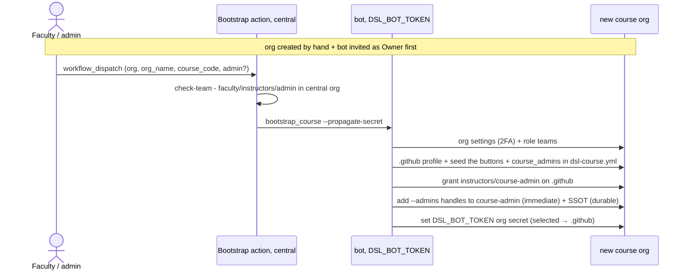
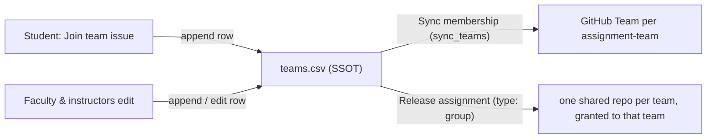
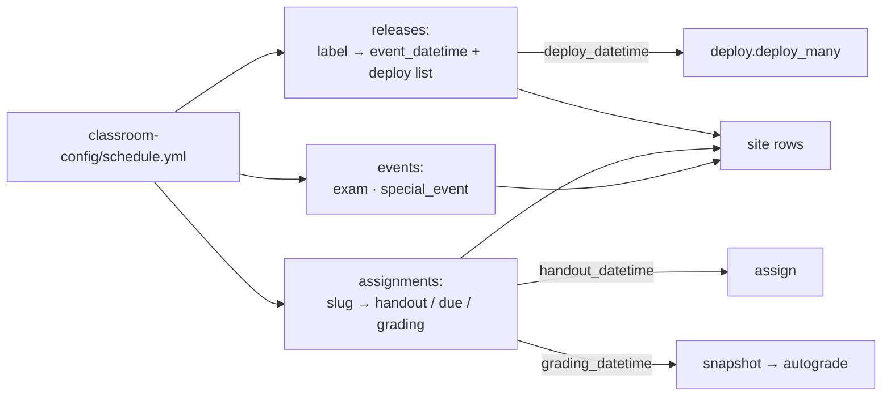
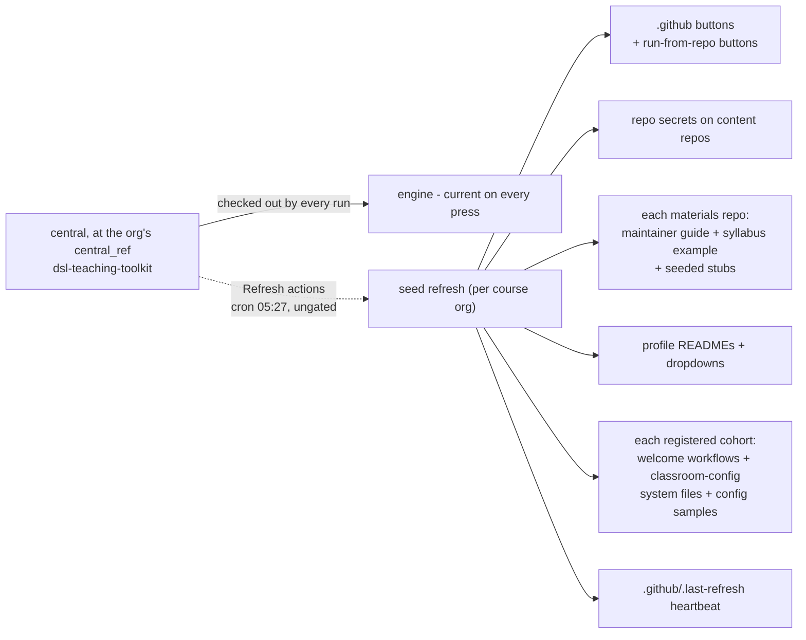
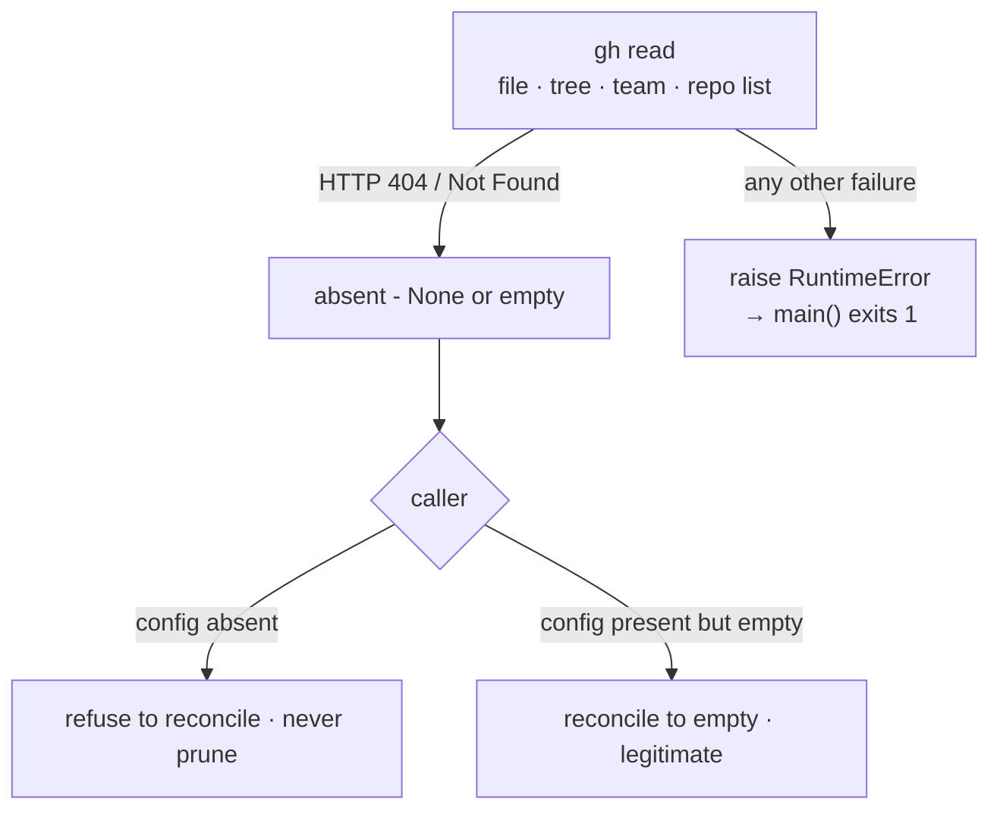
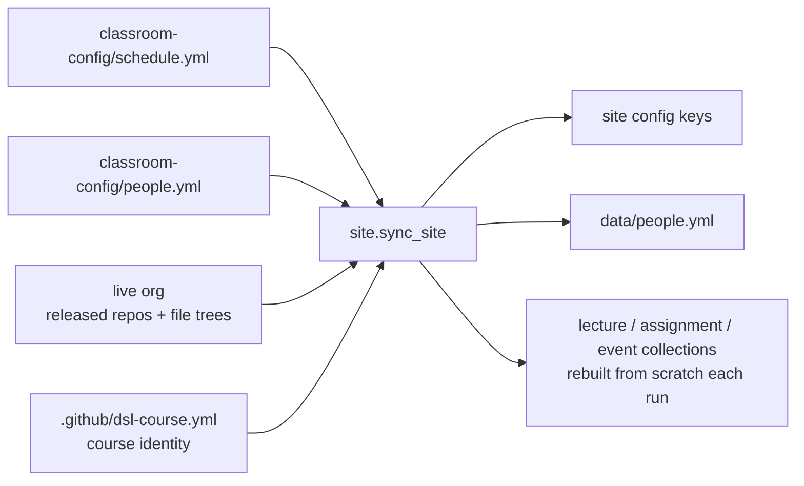

# Architecture & workflows

Admin / developer reference - **how the system is built and how the pieces move**. For the
faculty-facing overview see the [root README](../README.md); for operational specifics (PAT
scopes, granting access) see [admin-setup.md](admin-setup.md).

**You need this doc only if you're modifying `dsl_course/`, debugging a workflow failure, or
rotating the bot.** Everything faculty do is covered by the
[runbooks](../docs/README.md).

- [System overview](#system-overview)
- [The bot identity](#the-bot-identity)
- [Token & secret propagation](#token--secret-propagation)
- [Access model - two populations](#access-model---two-populations)
- [Core workflows](#core-workflows)
- [The schedule](#the-schedule)
- [The scheduler](#the-scheduler)
- [Autograding & containment](#autograding--containment)
- [Convergence - the daily self-refresh](#convergence---the-daily-self-refresh)
- [Failure semantics](#failure-semantics)
- [Dynamic dropdowns](#dynamic-dropdowns)
- [Repo discovery](#repo-discovery)
- [Cohort website](#cohort-website)
- [Course website (open courseware)](#course-website-open-courseware)
- [Bot lifecycle - setup & rotation](#bot-lifecycle---setup--rotation)
- [Code map](#code-map)

## System overview

Two org tiers plus one central control repo, all operated by a single **bot** identity.
GitHub has **no org-creation API**, so each org is created by hand and the bot is invited as
Owner; everything after that is a button.



Every button and cron lives in the **course** org's `.github`; cohort orgs hold no org-level
buttons of their own, only the `welcome` onboarding workflows and `classroom-config`'s
dispatchers/validator. Sources are always read course-ward, state is always written
cohort-ward, and the orgs come from the invocation - never from `schedule.yml`, which names
repos only.

## The bot identity

Every button runs server-side under **one** credential, `DSL_BOT_TOKEN` - the shared service
account **`hertie-dsl-bot`**, Owner of every course and cohort org. Faculty and instructors
never hold or see it; they click buttons, which run as the bot. Which account and its exact PAT
scopes: [ADMIN-SETUP](admin-setup.md#the-bot-account). Standing it up and rotating it:
[Bot lifecycle](#bot-lifecycle---setup--rotation).

## Token & secret propagation

The token is set **once**, in the central repo, and the actions **fan it out** - admins never
hand-edit per-org secrets.



Why three paths, and why `selected` visibility:

- On the **GitHub Free plan, org secrets don't reach private repos** - so content repos get a
  **repo** secret, set by **Refresh actions** (`seed._propagate_repo_secret`, which sets it on
  every discovered content repo, public ones included). `assignment-*` templates deliberately
  get none: they host no run-from-repo buttons (`discover_content_repos` excludes them), and a
  secret on a template would propagate into every generated student repo.
- The same gap hits the private **infra** repo `classroom-config`, whose workflows (a push to
  `students.csv`/`teams.csv`/`people.yml` fires **Sync membership**, a push to
  `schedule.yml`/`people.yml` fires **Sync site**, both cross-org) also run under
  `DSL_BOT_TOKEN`. Refresh sets the repo secret only on *content* repos, so **Bootstrap** mirrors the token
  as a **repo** secret onto each private infra repo in the same run that sets the org secret
  (`bootstrap_course.set_org_secret`) - that is the only path the token reaches
  `classroom-config`.
- An org secret with the gh-default `private` visibility doesn't reach **public** repos either,
  and `.github` / `welcome` are public. So the **org** secret is scoped
  **`visibility=selected → .github`** (plus `welcome` + `classroom-config` on cohort orgs, each
  scoped only if it exists), which reaches the public infra repos while keeping the org-admin
  token **out of** student repos. `visibility=all` would expose it to every workflow in the org.
- The value always goes over **stdin**, never argv, so it never appears in `ps`. Both writers
  **refuse** to publish when only a personal `GH_TOKEN` is set (a maintainer running
  `seed refresh` by hand would otherwise leak their own PAT into every content repo), and count
  the refusal as a failure rather than exiting green.
- On GitHub Team/Enterprise, org secrets reach private repos and this propagation is unnecessary.

**Trust boundary.** Every content repo therefore holds a copy of an org-admin PAT. That is what
makes the run-from-repo buttons work, and it is why `_is_infra_repo` excludes `*.github.io` from
discovery: publishing that secret to a public site repo would disclose it.

## Access model - two populations

Two **separate** gates - do not conflate them.



- **Provisioning** is a DSL-wide authority: the central `faculty`/`instructors`/`admin` teams, granted
  write/admin on the central repo, may run **Bootstrap Course Org**. Nothing else.
- **Running a course's buttons** is **per-course**: `course_admins` (course-wide admin) and each
  cohort's own `instructors`/`teaching_assistants` (per-cohort push).
- GitHub shows "Run workflow" only to **write+** users, and the seeded `check-team` job re-checks
  repo permission at run time. It is scoped `if: github.event_name == 'workflow_dispatch'` -
  cron and `repository_dispatch` runs have no actor to check, so those entry points are ungated
  by design and instead validate their **payload** (see
  [Failure semantics](#failure-semantics)). Teams are org-scoped (no cross-org grant exists), so
  `sync_faculty` runs two independent flows: `course_admins` mirrors the same desired membership
  into the course org AND every cohort; each cohort's people.yml reconciles into that cohort's
  `instructors` team AND a **parallel**, tag-scoped `instructors-<tag>` team on the course org -
  no merge across cohorts. Who-to-declare-where:
  [access-reference](../docs/reference/access-reference.md); the runbook for changing it:
  [05 Manage the teaching team](../docs/05-manage-teaching-team.md).
- Each person entry takes optional `start`/`end` ISO dates (`utils.active_today`), applied by
  `desired_team_members` to **both** flows. Since every reconcile is a full add-and-remove, a
  lapsed `end` prunes the member with no manual step. An *edit* to `people.yml` /
  `students.csv` / `teams.csv` dispatches Sync membership on the push; a *date* rolling over
  pushes nothing, so it lands on the daily cron.

Cohort-side, students land on `students` or `auditors` per their roster `role`. Both get read on
released materials; only `students` gets assignment repos and a gradebook.

## Core workflows

### Bootstrap a course org



`--admins` both invites those handles to `course-admin` directly (so they have access before
any sync runs) AND seeds them into `dsl-course.yml`'s `people.course_admins` - the single source
of truth (SSOT) `sync_faculty` reconciles against. **Anything not in the SSOT gets pruned by the next sync**,
so an admin added via the Teams UI or a one-off `gh api` call must also be declared in
`dsl-course.yml`.

A **cohort** is bootstrapped from the course org's own **Bootstrap cohort** button (not the
central action), given the empty cohort org's name. It runs the same `bootstrap_course` with
`--cohort`: seeds `welcome` + `classroom-config` (roster, teams, grades, `schedule.yml`,
`people.yml`), creates the `students` + `auditors` teams, tightens permissions, scaffolds the
website, applies the course's current `course_admins`, registers the cohort in the course's
`cohort-courses-pages.yml`, and writes a small `.github/dsl-course.yml` **pointer** (`course:`,
`org:`) so the cohort-side dispatchers know which course org to fire at. All of this cohort's
real config lives in `classroom-config`.

Every user-editable file in `classroom-config` ships as a **pair**: `<file>` is a minimal
commented scaffold, seeded once and never rewritten, so faculty edits are safe; `<file>.sample`
is a filled worked example, re-converged on every refresh. The SYSTEM-owned half - the README
contract and the three workflows under `.github/` (`welcome.CLASSROOM_SYSTEM_FILES`) - is
re-converged the same way, so a dispatcher fix reaches running cohorts without re-bootstrapping. Partial provisioning fails the run
loudly rather than leaving a half-built org.

### Release

**Materials** copies `course_source_path` - a folder, a single file, or a comma-separated list of
either - from a course-org `course_source_repo` into the cohort's `cohort_dest_repo` at
`cohort_dest_path` (default: mirror `course_source_path`). The repo is private, with read for both
the `students` and `auditors` teams. Those four fields are deliberately the same ones a
`schedule.yml` `deploy` entry carries, and both routes execute through the same
`deploy.deploy_many`, which clones each source and each destination once per batch. Only released
paths exist cohort-side; everything is idempotent and additive, so re-releasing is a no-op.

A source path of `/`, `.` or empty releases the **whole repo**. It skips `.git` at any depth and,
**at the repo root only**, `.github` and `MAINTAINING.md` - naming either explicitly still ships
it. A path escaping the clone is refused before any file is touched.

**Assignment** is two stages: freeze a cohort-level template from the course template's `main`
(so a mid-term edit to the course template can't change what a cohort was handed), then generate
one private `<slug>-<handle>` repo per onboarded, **enrolled** student *from the frozen copy*.
Solutions live on the course template's `solution` branch and are never shipped unless
`include_solution` is ticked. Whether a release fans out per student or per team resolves
through **one** precedence chain, `collect.resolve_is_group`: the workflow's `group` checkbox
(force) → the cohort's `assignments.<slug>.type` in schedule.yml → the template's own
`grading.yml` `type:` (the design-time default the scaffold wrote) → individual. Read-side only -
the cohort setting never writes back into the course org. Group repos are granted to the
materialised project Team; individual repos get the student as a direct collaborator.

After a handout, `schedule.record_handout` writes the date back into `schedule.yml` by
comment-preserving line surgery. It is **write-once** and may **decline** a file shape it cannot
safely edit; both the decline and a failed write log loudly, because a handout that went out and
is recorded nowhere is the failure worth seeing.

There is **no separate Code release**. Releasing a subpackage folder or a single module is just
Materials with `course_source_path` pointing at it (e.g. `mlpkg/simulation`), which is how a
package gets disclosed topic by topic. Materials and Assignment are exposed centrally (in
`.github`) *and* run-from-repo (in each content repo), from the same renderer; the run-from-repo
copy drops `course_source_repo` and knows that repo's own sections. All of them are the
**fallback path** - the schedule is the primary release mechanism; the manual buttons are for
demos, one-offs, and recovery.

### Student onboarding

```mermaid
sequenceDiagram
  actor St as Student
  participant W as welcome, Join course issue
  participant O as onboard.yml
  participant R as classroom-config roster
  St->>W: open Join course issue, paste the emailed enrol_code
  O->>R: match the code; record issue-author handle + immutable github_id
  O->>St: org membership + students (or auditors) team read
  Note over O,St: a push to students.csv triggers "Sync membership", reconciling both teams
```

The enrolment code is random and carries no personal data, so nothing in the public issue needs
redacting; it is unguessable and single-use, so a classmate cannot bind someone else's roster
row to their account. The handle comes from the issue **author**, so it cannot be spoofed.

Onboarding is **burst-safe**: concurrency is scoped per issue rather than per repo, and the CSV
write retries on 409/422 with the whole decision (duplicate check, size cap, append) *inside* the
retry - so two students submitting at once can neither be silently dropped nor both slip past a
full team.

### Project teams (group assignments)

`teams.csv` (in `classroom-config`, columns `assignment,team,github_handle`) is the **only
writer surface**: students self-select by opening a "Join team" issue (capped per assignment
by `max_team_size` in the cohort's schedule.yml, default 5; `team-formation.yml`
appends a row - authenticated author, one team per assignment, size-capped, auditors refused),
and faculty can edit it directly. The default cap is set by `MAX_TEAM_SIZE` in
`templates/welcome/team-formation.yml`.



`sync_teams` materialises a GitHub Team `<assignment>-<team>` from the CSV - **one-way and
idempotent**, so the Team is a downstream projection that can't drift. A push to `teams.csv`
triggers **Sync membership**, which always fully reconciles (add AND remove - the CSV is the
live truth).

Because `teams.csv` is student-writable, every handle in it is vetted against the onboarded
roster (`sync_teams.vet_handles`) before it is acted on, by both the sync and the assignment
fan-out. A typo'd or squatted handle is an error, not an invitation into the private org.

## The schedule

Each cohort's `classroom-config/schedule.yml` is the single home for its timed plan. Three
top-level blocks, each encoding a **behaviour**, plus `timezone`, `semester_start`,
`semester_end`.



| Block | Key fields | Fires |
| --- | --- | --- |
| `releases.<label>` | `event_datetime`, `deploy[]` of `course_source_repo` + `course_source_path` (required), `cohort_dest_repo` (default `materials`), `cohort_dest_path` (default: mirror), `deploy_datetime` | a deploy per entry |
| `assignments.<slug>` | `course_source_repo` (**required**), `due_datetime` (**required**; a bare date closes at 23:59:59), `grading_datetime` (default: due), `handout_datetime`, `cohort_dest_repo` (default: the slug), `type`, `max_team_size` | handout, then snapshot + autograde |
| `events.<label>` | `type` (`exam` \| `special_event`), `title`, `event_datetime` | nothing - display-only site rows |

- **Parsing is total but never silent.** An entry that is valid YAML yet not a valid schedule
  entry is dropped (or kept on a documented fallback) and recorded in `Schedule.dropped`, so the
  rest of the term still parses. `load` logs the list, `--validate` fails on it, and **Check
  cohort setup** counts it.
- **Validated where it is edited.** `validate-schedule.yml`, seeded into each cohort's
  `classroom-config`, runs the *same* parser from central on every push touching `schedule.yml`.
  Free private repos have no branch protection, so it cannot block the commit: instead it goes
  red and opens (or comments on) an issue assigned to the pusher, auto-closed by the next clean
  push. CI gates the same parser centrally.
- **Times are normalised at parse.** A naive datetime is read in `timezone` (default
  `Europe/Berlin`); an explicit offset names the same instant and is *converted into* it - so
  every datetime downstream is already the cohort's own wall clock, and what the site shows is
  what it fires at.
- **`tbc`**: `event_datetime: tbc` gives a dateless site row that can never fire; `tbc: true`
  beside a real date fires normally and marks the row.

## The scheduler

The intended operating mode: fill `schedule.yml` once and the hourly **Scheduled release** cron
runs the term. It calls the *same* idempotent functions the manual buttons do, so re-running a
*release* is a no-op and there is no "already released" state to track. Grading is the exception:
it must not repeat, so its state lives in the artefacts it writes (see
[Autograding](#autograding--containment)). Manual `workflow_dispatch` runs default to
`dry_run=true`; the cron passes no inputs and so releases for real. Like the other crons it is
ungated - a scheduled run has no actor. It is serialised against itself
(`concurrency: scheduled-release`, queued not cancelled) because a pass can outlive its hour and
two overlapping passes could double-fire whatever the first has not yet marked. A course org with
**no registered cohorts** is a quiet no-op that exits 0 - the normal state between bootstrapping
a course org and its first cohort.

Each hourly tick, per cohort:

1. **Freeze passed deadlines** - for every assignment whose grading deadline (`grading_datetime`,
   else `due_datetime`) has passed and has no snapshot yet, record the commit each submission
   repo is at into `classroom-config/snapshots/<name>.csv` (`repo,sha,recorded_at`).
2. **Autograde those same assignments, once each** - from the course-org template, skipped
   gracefully when there is no such repo, no `solution` branch, or `autograde: false`.
3. **Fire every action whose time has arrived** - each deploy at its `deploy_datetime` (else its
   entry's `event_datetime`), and assignment handouts at `handout_datetime` (synthesised into the
   release plan and re-sorted into time order). Deploys go out as one batch, then handouts, then
   exactly one site sync if anything changed.

Phases 1-2 run before the releases and run whether or not the cohort uses `releases` at all. A
cohort that raises is caught, logged and OR'd into the exit code, so one bad cohort cannot skip
the rest.

## Autograding & containment

**Fire-once is explicit, not inferred.** Each phase's marker is an artefact written *last*, on
success only:

| Phase | Marker | Meaning |
| --- | --- | --- |
| snapshot | `classroom-config/snapshots/<name>.csv` | frozen; `snapshot_assignment` refuses to overwrite |
| autograde | `autograde/<name>/_graded.json` | graded - never again |
| autograde | `autograde/<name>/_skipped.json` | deliberately not machine-graded, with the reason |

A `_skipped.json` stops a hand-marked assignment being re-cloned and re-decided every hour; both
sentinels are **withheld** when any target was unreachable or an archive write failed, so a
transient outage retries instead of permanently marking the assignment done. Re-grading means
deleting the marker.

**Why snapshots.** A git committer date is entirely client-supplied (`GIT_COMMITTER_DATE`), so a
`git rev-list --before` pin can be defeated by backdating a late commit. The snapshot is recorded
at a time the **server** chose and is write-once, so a later push cannot move the pin. Grading
pins to the recorded sha; a blank sha means nothing was pushed by the deadline and scores zero;
**no** snapshot file at all falls back to the date-based pin with a loud warning. If the pinned
sha has been force-pushed away it is fetched as an orphan, and scores zero if unrecoverable -
rewritten history is never graded. Honest limitation: a post-deadline push carrying a spoofed
pre-deadline date, landing before the first tick, is still captured - the backdating window
shrinks from unlimited to ≤1h, it does not close.

**Containment.** Grading executes student code on the runner *under the bot's org-admin token*,
so the run is isolated before any submission is touched: the credential is stripped from the
environment and the clone's `.git` deleted; static test rigging (`report.xml`, `conftest.py`,
`sitecustomize.py`, `pytest.ini`, …) is removed by a walk that does **not** follow symlinks (a
committed link cycle would otherwise hang the run); tests and the junit report live in a separate
runspace that the submission is appended *after* on `sys.path`; every subprocess starts its own
session under POSIX rlimits (address space, CPU, nproc, file size) and a wall-clock timeout that
SIGKILLs the whole **process group**, so a fork or memory bomb scores a recorded zero instead of
OOM-killing the job and blocking the cohort's grading forever. Known, accepted residual: there is
**no network isolation**, and graded code running in-process can forge its own report - which is
why `autograde_score` is faculty-reviewed before distribution and never shown to students directly.

**Grades** are three idempotent stages: `sync` creates a private `grades-<handle>` per onboarded
enrolled student; `render` pivots the CSVs into a preview PR on branch `grades-update`; and
`distribute` pushes each student's `grades.yml` and emails them. Machine-written cells
(`autograde_score`, `team`) are **write-once**, and `render` refuses to force-push its branch if a
non-bot commit sits on it - a reviewer's correction is never clobbered.

## Convergence - the daily self-refresh

Seeded workflow YAML is frozen in each org at seed time, while the engine it calls is always
checked out from central at **that org's** ref - `central_ref:` in its course org's
`.github/dsl-course.yml`, defaulting to `central.CENTRAL_REF` (`release`); cohorts inherit
their course org's. A merge to `main` changes nothing in any live course: promoting it to
`staging` (the demo org) and then `release` is a deliberate second act, and a rollback is a
revert on `main` promoted forward, which every org picks up on its next run with no re-seed.
Engine changes therefore land on the first press after a promotion; *workflow shape* changes
land because every course org re-seeds itself nightly - and the Promote workflow dispatches
that refresh rather than leaving it to the cron. See
[central-admin.md](central-admin.md#deploying-the-toolkit).



- **Ungated** (no `check-team`): a scheduled run has no actor, and manual dispatch already
  requires write on the repo - which is the very thing the gate verified.
- `put_file` is **diff-aware** (it compares the blob sha it computes locally against the one it
  already fetched), so a no-change night writes no commits in any org.
- The **heartbeat** `.github/.last-refresh` is stamped daily for one reason: GitHub disables
  scheduled workflows in a repo inactive for 60 days, which would silently switch off every cron
  in the estate. A failed heartbeat write counts into the exit code.
- Serialised against **itself** (`concurrency: seed-refresh`) because one run makes dozens of
  Contents-API writes across a whole org. Deliberately *not* shared with the buttons that end in
  a refresh: an Actions group holds only one pending run, so a third arrival cancels the second,
  and an operator's click silently doing nothing is worse than a visible 409.
- Cohort orgs run **no cron of their own** - their convergence is entirely driven by the parent
  course org's refresh. A deleted cohort org (404) or an archived `classroom-config` is skipped
  with a hint rather than reddening the run forever.

## Failure semantics

The estate is unattended. The governing rule is that **absence and failure must never look
alike**.



- One helper, `utils.is_missing_resource`, owns the 404-vs-failure split; `get_file_content`,
  `repo_tree`, `load_yaml_config` and `delete_file` all go through it. A returned `None`/`[]`/`{}`
  therefore means *genuinely absent*, never *couldn't read*. Before this, a rate limit could
  republish a cohort site with every session row deleted, green.
- **Absent vs empty** is the anti-eviction invariant: a missing `people.yml` / `students.csv`
  makes the sync refuse and return 1; an empty one legitimately empties the team.
- `reconcile_team_members` is the single prune guard: unreadable current membership aborts the
  reconcile entirely, an unreadable owner list still adds but skips the prune pass, and org
  owners plus the acting token are never pruned.
- **Batch isolation**: `sync_membership` and `site --all-cohorts` catch per cohort and OR into
  the exit code, so one bad cohort cannot skip the rest.
- **Payloads are not trusted.** A `repository_dispatch` naming a cohort org absent from the
  course org's registry is refused by `sync_membership` and `site.main` - the registry, not the
  payload, is the authority on which cohorts a course org may reconcile.
- **Unattended failures are visible.** The five crons (Scheduled release, Sync membership, Sync
  site, Refresh actions, Publish course website) open - or comment on - an issue titled
  *"\<workflow\> is failing"* in the course org's `.github`, and close it on the next success. An
  open issue always means "still broken". Manual dispatch is exempt: someone is watching.
- **Courtesy paths never fail their caller.** The site's overwrite notice logs loudly and leaves
  the exit code untouched - by the time it runs the site is already published, and letting it
  redden the cron would invert the incident it exists to prevent.
- **Estate-wide workflow policy**, swept by tests so a new renderer cannot regress it: workflow
  level `permissions: {}` (or the minimum actually used), a `timeout-minutes` on every job,
  third-party actions pinned to commit SHAs, and no `${{ }}` interpolation inside `run:` blocks -
  values arrive through `env`. These workflows run with an org-owner PAT in the environment.

## Dynamic dropdowns

`workflow_dispatch` dropdowns are static YAML and can't depend on another input, so **Refresh
actions** regenerates them from live state and re-pushes the workflows (no cron, no app) - the
same run re-seeds the run-from-repo buttons, propagates the repo secret, and rebuilds the profile
READMEs.

- **cohort_org** - from the `.github/cohort-courses-pages.yml` registry.
- **course_source_repo** (central only) / **assignment** - the course org's content / `assignment-*` repos.
- Every list-taking dropdown **pre-selects the newest term year** rather than letting GitHub
  select the alphabetically-first option, which used to pre-select last year's cohort. The one
  deliberate exception is Sync membership, pinned to a `(faculty only)` placeholder so acting on
  membership stays opt-in.
- **course_source_path / cohort_dest_path** - free text. Both accept a comma-separated list,
  paired by index; a blank `cohort_dest_path` mirrors every `course_source_path`, and a count
  mismatch fails the run loudly (`deploy.parse_path_pairs`) rather than guessing. Comma-separated
  lists exist because `workflow_dispatch` has no array input and its string fields are
  single-line, so a multi-line YAML blob cannot be entered.
- **cohort_dest_repo** - free text and **required on the button**: a defaulted destination
  quietly creates a second materials repo the cohort never sees. `schedule.yml` `deploy:` entries
  may still omit it and take the executor's `materials` fallback.
- Sections are **not an input**. The button takes five fixed inputs whatever the repo's shape,
  well inside `workflow_dispatch`'s 10-input limit. The `<section>/<NN>_.../` convention still
  matters, but only to the **website** builders.

## Repo discovery

One predicate, `discovery._is_infra_repo`, keeps infrastructure out of **both** orgs' dropdowns
and scans - so a repo type added on one side can't leak into the other. It excludes:

- names in `INFRA_REPOS` = `welcome`, `classroom-config`, `.github`;
- anything ending `.github.io` (the generated site repos - critical, since content repos are
  handed the org-admin token as a repo secret and would publish it to a public repo);
- any repo carrying a topic in `INFRA_TOPICS` = `submission`, `assignment-template`, `gradebook`
  (per-student submission repos, frozen cohort-side templates, private `grades-<handle>` repos).

On top of that, `discover_content_repos` also drops `assignment-*` (equipping a template with
the faculty workflows would copy them into every generated student repo), and
`discover_assignments` selects `assignment-*` that are `isTemplate`. Listing is
paginated (`orgs/<org>/repos?per_page=100`), because a cohort org holds a repo per student per
assignment plus a gradebook each.

## Cohort website

Every cohort gets an **auto-deployed website** at `<cohort-org>.github.io`, generated from
`course-website-template` by `scaffold_site` during Bootstrap cohort. `site.sync_site` then
regenerates its content from the live org structure.



**Triggers**: a push to the cohort's `schedule.yml` or `people.yml` (a `repository_dispatch` from
`classroom-config`), a push to the course org's `dsl-course.yml`, a daily 06:00 cron, manual
**Sync site**, and every release - `deploy`, `assign`, the scheduler and Bootstrap cohort all
call `sync_site` in-process when they change something.

**Row types.** The three collections are rebuilt from scratch each run, so a de-released row
disappears. Each row carries its own `type`, and the theme picks a template - and therefore a
colour - from it alone: `lecture`, `lab`, `assignment` (with a nested `due` event), `exam`,
`special_event`, `term_date`. Lecture vs lab is decided by the **released section directory**
(`labs/`), never by a faculty declaration; term rows are synthesised from `semester_start` /
`semester_end`; undated entries sort to the end of term and render as TBC.

**The plan is public; the payload is gated.** Every dated entry in `schedule.yml` gets its row
the day it is written, whether or not it has shipped - so the schedule publishes the whole term.
What release adds is the row's CONTENT: a session picks up its file links (`unreleased: true` /
`readings_pending: true` until then) and an assignment its brief and its README-given title
(`handout_pending: true` until then, and the README is not read at all while it holds - the
template repo exists weeks early and the cohort site is public).

**People.** Cards come from that cohort's `classroom-config/people.yml`. With no `people:` block
at all, they fall back to the cohort org's `instructors` GitHub team - minus the sync's own bot
account, which sits in that team for access and is not a member of staff. A 404'd member is
skipped; any other lookup failure raises, rather than silently dropping an instructor.

**Generated files say so.** `_data/people.yml` is written with a header stating that it is
generated, that every sync rewrites it, and which file to edit instead. The active half is the
**overwrite notice**: after a successful push, the sync looks at what its own commit rewrote
(`git log -1 HEAD^ -- <path>`), and if the previous author was not one of the machine identities
- the git identity it commits under, the acting token's account, or any `…[bot]` - it opens, or
comments on, a single stably-titled issue in the site repo linking each discarded commit and
naming where the edit belongs. Detection and filing are wrapped so that any failure logs and
leaves the sync's exit code alone.

**Archived repos are a quiet skip.** A past cohort's site repo clones and commits fine and only
403s on the push, so an archived `<org>.github.io` is skipped like a missing one instead of
failing the daily cron forever.

## Course website (open courseware)

A course can **optionally** publish a **public** site at `<course-org>.github.io` via the
**Publish course website** action (`public_site.sync_public_site`). It reuses the same
`course-website-template` + `scaffold_site`, but differs from the cohort site in one decisive
way: the cohort site *links* to files in private repos (404 for non-members, by design),
whereas the course `course-materials-*` repos are private too, so the public site **hosts the
shared files itself** under `public-materials/<source-repo>/session-N/...` (Jekyll serves any
path not starting with `_`) and links to those site-relative URLs. Only that source's subtree is
rewritten per run, so several years can coexist.

- **Lectures** are always hosted; **readings** are either a text-only reading list
  (`reading-list` - citations, no files, copyright-safe) or hosted + linked
  (`actual-readings`). `none` skips readings. A published `labs/` section renders as its own
  `type: lab` row beside the session row. Lectures, labs + readings only - no assignments, no
  exam rows. Its `_data/people.yml` comes from the course org's `people:` block, TAs excluded.
- **Opt-in, then automatic.** The first run scaffolds the site; every run records its settings
  in `_publish-config.yml` at the site root (`_`-prefixed so Jekyll ignores it) and a daily cron
  re-syncs from them, so materials edits reach the public site without another click. **Delete
  `_publish-config.yml` to stop the automatic refresh.** The cron is a no-op wherever nobody has
  published, and releases/refresh never touch it - a public site exists only once someone runs
  the action.

## Bot lifecycle - setup & rotation

Standing the bot up, minting and rotating its PAT, and the ordering rules that make rotation
safe (Owner before token, central-org membership, revoke the old PAT last) live in
**[central-admin.md](central-admin.md#bot-lifecycle---setup--rotation)**.

Architecturally, all you need here: one credential, `DSL_BOT_TOKEN`, is set by hand in the
central repo and fanned out by Bootstrap/Refresh - see
[Token & secret propagation](#token--secret-propagation).

## Code map

Self-contained - workflows and their Python implementation both live in this repo.

- `.github/workflows/` - `bootstrap-org` (the one central button) + `refresh-inventory`
  (weekly cron regenerating `bootstrapped-orgs-inventory.md`) + `ci`. The faculty workflows are
  *rendered* and seeded into the course/cohort orgs, not kept here.
- `dsl_course/`:
  - `central` - the one definition of which repo/ref every seeded workflow checks out; imported
    by both the renderers and the generated READMEs so the two can't disagree.
  - `bootstrap_course` - configure a course or (`--cohort`) cohort org; tighten BOTH kinds to
    `default_repository_permission=none` (a course org holds the unreleased materials and the
    assignment `solution` branches, so members must not read it by default either); create
    teams; grant button access on `.github` and, cohort-side, on the infra repos faculty
    actually work in (`grant_cohort_faculty_access` / `COHORT_FACULTY_REPOS` = `welcome`,
    `classroom-config`, so non-owner instructors get write and course-admin gets admin);
    propagate the secret.
  - `seed` - place the workflows (central + run-from-repo) and the `refresh` CLI, whose nightly
    run also loops every registered cohort (orgs missing two runs running pruned with a hint, archived ones left
    frozen) re-converging its welcome workflows, classroom-config system files and samples; it
    delegates to four modules and re-exports a few of their names (see `__all__`; new code
    imports from the owner):
    - `workflows_render` - the workflow YAML templates + every `render_*` function, plus the
      shared preamble policy (gating, permissions, timeouts, concurrency, cron failure notices);
    - `discovery` - the cohort registry and all live org/repo/section/session discovery,
      including the shared infra-repo predicate;
    - `profile_readme` - the org landing page + the `.github` repo's own README;
    - `welcome` - the SYSTEM-owned cohort seeding (onboarding workflows, issue forms,
      `classroom-config` scaffolds, samples and system files), split out so `seed.refresh` can
      re-push it without importing `bootstrap_course` back.
  - `scheduler` - the hourly cron: freeze passed deadlines, autograde, then fire due releases.
  - `schedule` - parse and validate `schedule.yml` (the three blocks, timezone normalisation,
    dropped-entry reporting, write-once handout records).
  - `deploy` - the single release executor (`deploy_many`): copy each source path into its
    cohort repo additively, cloning every repo once per run. Shared by the button and the scheduler.
  - `assign` - freeze a cohort assignment template, then fan out per-student (or per-team) repos.
  - `collect` - the faculty-side autograder: deadline snapshots, pinned checkout, contained test
    run, fire-once sentinels, `autograde_score` into the grade CSV.
  - `grades` - gradebook repos (`sync`), the preview PR (`render`), fan-out + email (`distribute`).
  - `enrol_codes` / `mailer` - generate + email enrolment codes; Graph or SMTP transport.
  - `scaffold` - create structured materials / assignment repos + the website (cohort or course).
  - `site` - regenerate the cohort website (`sync_site`) and the public course website
    (`sync_public_site` / `resync_public_site`).
  - `sync_roster` / `sync_teams` - reconcile the `students`+`auditors` teams / per-project teams
    from `students.csv` / `teams.csv` (one-way: the CSV is truth).
  - `sync_faculty` - reconcile `course-admin` from the course org's `people:` SSOT into the
    course org + every cohort; and, per cohort, its own `people.yml` into that cohort's
    `instructors` team + a tag-scoped `instructors-<tag>` team on the course org.
  - `sync_membership` - the one consolidated entrypoint (roster + teams + faculty) behind the
    **Sync membership** button/cron/dispatch.
  - `roster` / `teams` - read `students.csv` / `teams.csv`.
  - `status` - the **Check cohort setup** per-cohort checklist.
  - `list_orgs` - enumerate DSL course and cohort orgs by topic; drives `refresh-inventory.yml`.
  - `utils` - shared `gh`/git helpers with rate-limit backoff, and the fail-loud read contract
    (`is_missing_resource`) plus the prune guard (`reconcile_team_members`).
- `templates/` - the files bootstrap seeds into a fresh org, verbatim from disk
  (`welcome.template`), one subdirectory per destination:
  - `welcome/` - the cohort onboarding + team-formation workflows and their issue forms.
  - `classroom-config/` - that repo's README contract, its dispatch + schedule-validation
    workflows, and the **scaffold** half of every user-editable file: header-only
    `students.csv` / `teams.csv`, tag-rendered `schedule.yml` / `people.yml` skeletons.
    The **sample** half (`<file>.sample`) is not authored here - it is injected from
    `example-course/cohort-org/` (`welcome.CLASSROOM_SAMPLES`), so the shipped worked
    examples and the documented ones are the same files.
  - `course/` - the course org's `.github/dsl-course.yml` (identity + the `people:` block,
    assembled from the `people-*.yml` fragments).
  - `cohort/` - a cohort org's `.github/dsl-course.yml` pointer back to its course org.
  - `site/` - the course-specific Jekyll layouts, includes and `_sass/_course.scss` that
    the sync writes into every `<org>.github.io` (`site_repo.site_templates`).
    Not seeded once like the rest of this directory - converged, so a rendering change
    reaches every live site. The generic chrome stays in `dsl-jekyll-theme`, pinned at
    `site_repo.THEME_REF`.
