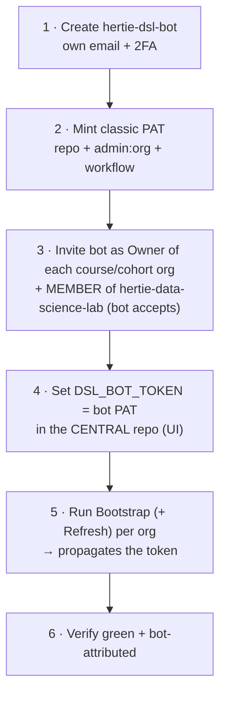

# Central admin - the DSL org

Who may provision course orgs, how to rotate the bot's token, how a toolkit change reaches
live orgs, and where to see which orgs exist.
Per-course access: [access-reference.md](../docs/reference/access-reference.md). PAT scopes and the token model:
[admin-setup.md](admin-setup.md).

## Granting a new instructor access

There is no config file for this. **Someone already in `hertie-data-science-lab` adds the new
person to one of its three provisioning teams via the GitHub Teams UI** - that is the only way
in, and it gates every central button.

| Team | Who | Toolkit repo |
|---|---|---|
| `faculty` | core DSL faculty | write |
| `instructors` | everyone else who teaches a DSL course | write |
| `admin` | maintainers of the toolkit itself | admin |

`faculty` and `instructors` are **access-identical**; the split records who someone is, not what
they may do. Everyone teaching a course is an instructor, and all faculty teach - but not every
instructor is core faculty, so a person belongs to exactly one of the two.

- **Bootstrap Course Org** checks membership of all three teams. No membership, no org
  provisioning.
- **Write is what makes the button clickable** - GitHub only shows *Run workflow* to users with
  write on the repo, and the `check-team` job is a second gate on top of that. Downgrading a
  team to read would silently remove its Bootstrap access, not just its push rights.
- The toolkit's `main` is **branch-protected** (changes go via PR).
- This authority is DSL-wide and *creation-only*. It grants **no** access to any course's own
  buttons - those come from that course org's `course-admin` / `instructors-<tag>` teams
  ([access-reference.md](../docs/reference/access-reference.md)).

## Bot lifecycle - setup & rotation

Every org holds its **own copy** of the bot's PAT (an org secret, plus repo secrets on private
repos on the Free plan), so rotating the token is a per-org operation, not one edit.

**Rotation:** mint a fresh PAT (2), set it in the central repo (4), re-run Bootstrap + Refresh
(5) **for every org** - a central edit alone changes nothing out there - verify (6), then
**revoke the previous PAT last**, only after *every* org verifies green under the new one. Set a
PAT expiry so rotation is forced.

The [nightly self-refresh](architecture.md#convergence--the-daily-self-refresh) does **not**
rotate anything: it runs *inside* each org under that org's own copy of the secret and simply
republishes it. Rotation is still a per-org Bootstrap run from central.

**Hard rules** (ordering is not optional):

- **Owner before token.** Invite the bot as Owner and have it accept (3) before propagating (5).
- **The bot must be a member of the central org.** Bootstrap's team gate reads
  `hertie-data-science-lab`'s teams **under `DSL_BOT_TOKEN`**; without that membership the gate
  **denies everyone**. Member is enough; it needn't be an owner there.
- **Swap central only after a one-org test.** Setting the central secret (4) doesn't touch
  existing org secrets, so it's safe - but prove it on one org before the rest.
- **Never paste a token into chat, PRs, or issues.** Set it *only* via the Secrets UI; a token
  exposed anywhere must be **revoked and reissued** immediately.

## Before bootstrapping a new org

- Create the org by hand in the GitHub web UI (there is no org-creation API).
- Invite the bot as an **Owner** and have it **accept** before Bootstrap runs - an unaccepted
  invite makes the run fail. Same for cohort orgs.
- Walkthroughs: [01-new-course-org.md](../docs/01-new-course-org.md) and
  [04-new-cohort-org.md](../docs/04-new-cohort-org.md).

## Email

Enrolment-code and grade emails go through `dsl_course.mailer` under a **tenant-level mail
credential** - a one-time central setup, not per course. `dry_run` previews need nothing.

Four secrets: `GRAPH_TENANT_ID`, `GRAPH_CLIENT_ID`, `GRAPH_CLIENT_CERT`, `GRAPH_SENDER`. The
Entra app holds the **Mail.Send** application permission (admin-consented) and sends as the
shared mailbox `datasciencelab@hertie-school.org`. There is no SMTP fallback: the tenant
disables SMTP AUTH, so it could never fire.

`Mail.Send` is tenant-wide by default; an Exchange application access policy restricts this app
to that one mailbox. Verified 2026-08-31: sending as any other mailbox is refused with
`ErrorAccessDenied ... [RAOP]`. Re-check after any change to the app registration.

The app authenticates **by certificate, not a client secret**. `GRAPH_CLIENT_CERT` is one
multi-line secret holding the PEM certificate *and* its unencrypted private key (as
`cat cert.cer key.pem` produces); the mailer derives the `x5t` thumbprint from the certificate
itself, so the two halves cannot drift apart. Entra holds only the public half.

**Certificate expiry: 2028-08-26.** Nothing warns you but the mailer, which logs a warning
inside 30 days *on a run that actually sends* - a lapse otherwise surfaces as enrolment codes
silently not arriving. To rotate: generate a new keypair, upload the new `.cer` to the app
registration (it can hold several), update `GRAPH_CLIENT_CERT`, then remove the old certificate.

Because a GitHub secret can be written but never read back, and Entra only ever gets the public
half, **the private key needs a copy outside GitHub** - institutional password manager or a
shared vault, never the repo. Without one, a lost laptop means a new keypair and an Entra ticket.

Set the secrets once as **org** secrets on each course org (`--visibility all`); the send
workflows run in that org's public `.github`, so no per-repo propagation is needed. A `dry_run`
acquires a token after printing its preview, so a credential that is SET but wrong reds the
run. An org with no secrets at all still previews green, saying the preview proves nothing.

**Status: live on `hertie-dsl-demo-course-e1234`, `hertie-intro-to-data-science-c11`,
`hertie-maths-data-science-C23` and `hertie-nlp-e1282`.**

## Deploying the toolkit

Every seeded workflow in every org checks this repo out at run time, so whatever sits on the
ref an org runs **is** that org's engine. Two tiers, two branches:

| Tier | Branch | Runs on |
|---|---|---|
| trunk | `main` | the demo course org and its cohorts. PRs squash-merge here |
| release | `release` | every real org, and the default for one that declares nothing |

`release` never carries commits of its own: it is always a fast-forward of `main`. An org's
tier is `central_ref:` in its **course** org's `.github/dsl-course.yml`; cohorts inherit it. The [inventory report](https://github.com/hertie-data-science-lab/dsl-teaching-toolkit/actions/workflows/refresh-inventory.yml) shows it per course org, and
**Check cohort setup** shows it per cohort.

`release` does not exist until someone makes it, and `central.CENTRAL_REF` is already
`release`. **Order, on first setup:**

1. Merge to `main`. **Deploy main** refreshes every org on `main` as it lands.
2. Run **Promote to release**. The first run creates the branch from `main`.
3. Verify one org: open a workflow in its `.github` repo and check the checkout step's
   `ref:` is the tier you expect.

A refresh will not render a ref that is not there. `seed.refresh` checks the central repo
for it first, and if it is missing it logs the org and the ref, goes red, and **leaves the
org's existing workflows alone** - stale workflows that run beat current workflows that
cannot check anything out. So a forgotten tier branch costs a red cron, not an org whose
whole Actions tab (Refresh included) fails at checkout forever.

### Deploy main

Nothing to press. **Deploy main** runs on every push to `main` and refreshes every course org
that declares `central_ref: main` - the demo course org - out of the merged commit, so the
engine and the rendered workflow shapes land together instead of the shapes waiting for that
org's 05:27 cron. An empty selection (no org on `main`) is a green run that says so.

### Check the demo org before you promote

**This inspection is the gate to `release`.** There is no approval environment on Promote,
and a green test suite is not a substitute: a person has to read what the demo org actually
did. The merge has already deployed to the demo course org (`hertie-dsl-demo-course-e1234`)
and both its cohorts (`hertie-dsl-demo-f2025`, `hertie-dsl-demo-f2026`), end to end - issues,
issue comments, the mails that went out, the run logs and the cohort site. A day covers one
nightly refresh:

- [ ] **Deploy main** green, and so is the org's own next nightly **Refresh actions**
- [ ] one **Scheduled release** tick green (a dry run is enough if nothing is due)
- [ ] a **Join** issue with a deliberately wrong code is rejected as usual
- [ ] **Check cohort setup**'s mail-transport row reads `all 4 GRAPH_* secrets set` (the codes send has no preview mode - this row is how the credential is checked without mailing a cohort)
- [ ] `DSL_E2E=1 pytest tests/e2e -q` green (the end-to-end harness - run against the demo org before promoting, never instead of reading it; see [maintainers.md](../docs/reference/maintainers.md#end-to-end-harness) for the env it needs)
- [ ] no failure issue opened in `hertie-dsl-demo-course-e1234/.github`

### Promote to release

Run **Promote to release** (Actions tab of this repo) once the manual end-to-end inspection
of the demo org above has passed - that inspection is the gate, and nothing in the workflow
enforces it.

`ref:` is required and has **no default**. Name the 40-character SHA the demo org was
inspected at - the head commit of the **Deploy main** run that refreshed it. `main` as a
default would have shipped whatever its tip was at the moment of the click, which is not
necessarily the commit anybody looked at; everything on main up to the commit named ships.
The run prints that list of commits before it pushes.

Promote refuses anything that is not both on `main`'s history and a descendant of `release`'s
current tip, so it can only ever move `release` forward - it cannot rewrite it, and cannot
ship what `main` has not seen. It then runs each course org's refresh itself, out of the
promoted checkout, so they converge in minutes rather than at the next 05:27 cron - and so an
org that has just changed tier is re-rendered by the tier it is joining, not the one it is
leaving.

Anyone with write on this repo can run it, and there is no approval environment on top of
that: the code has been live in the demo org since it merged, and the gate is that somebody
looked at it there. Nothing else can push to `release` - see
[Protecting the tiers](#protecting-the-tiers-set-by-hand).

### Rollback

**First, if the damage is live: pin the affected org back.** Set that course org's
`central_ref:` to the last known-good commit SHA in its `.github/dsl-course.yml` and run
**Refresh actions**. One file edit, no PR, no review, and it moves that course only - every
other org keeps running the tier. This is the isolated hotfix path, and it is available
immediately.

**Then fix it properly: revert on `main`, and promote.**

1. `git revert <the bad commit>` on a branch, PR it, squash-merge to `main` as usual -
   which deploys the revert to the demo org on its own.
2. Run **Promote to release**.
3. Unpin whatever you pinned in step 1.

Promotion is a fast-forward, so it ships **everything on `main` up to the commit named**,
not that commit alone - naming the revert commit rather than the branch tip stops at the
revert instead of also taking whatever landed after it, but it still carries every commit
before it. That is the whole model: the only way to undo something is a commit that says so.
Promote cannot move a tier backwards, nothing is ever force-pushed, and no org is handed a
history CI never ran.

**An org that already picked the bad build up** has nothing to undo - orgs keep no copy of
the engine, they check it out per run, so the next run uses the reverted code. The exception
is rendered workflow *shape* (inputs, jobs, crons), which is frozen in the org until its next
**Refresh actions**; the merge and the promotion each fan that out, and any faculty member can
re-run it by hand.

### Protecting the tiers (set by hand)

Promote's checks are worth nothing on their own: `faculty` and `instructors` both hold write
here, so without this any of them can `git push origin whatever:release` and put unreviewed
code straight into every live org. Two settings, neither of them in code:

1. **A repo deploy key with write, as `PROMOTE_DEPLOY_KEY`.** Promote pushes as that key,
   not as `GITHUB_TOKEN` or the bot: a deploy key is scoped to this repo alone, and it is
   the one actor a ruleset bypass can name that no person and no Actions token can be.
   `ssh-keygen -t ed25519 -N "" -C promote@dsl-teaching-toolkit -f promote_key`; the public
   half goes to Settings -> Deploy keys -> Add deploy key, **Allow write access**; the
   private half to Settings -> Secrets and variables -> Actions -> `PROMOTE_DEPLOY_KEY`.
   **The DSL bot holds `read` here** - it reads across orgs for Promote's refresh fan-out
   and never pushes.
2. **A repository ruleset on `release`** (Settings -> Rules -> New branch ruleset): target
   that branch, *Restrict updates*, *Restrict deletions*, *Block force pushes*, *Require
   linear history*, and set the bypass list to **Deploy keys** only. Promote passes
   `--force-with-lease` purely as a concurrency guard; every push it makes is a
   fast-forward, so blocking force pushes never blocks it.
On `main`: PR only, with **both** `ci.yml` jobs required - `pytest` **and**
`jekyll-contract` - and those checks set **strict** (*Require branches to be up to date
before merging*). Strict is load-bearing, not tidiness: **Deploy main** deploys every merge
to the demo org with no CI gate of its own, and the whole argument for that is that a commit
reaching `main` was green *as the tree it creates* - which a stale squash would not have
been. Required checks are named by hand and a job can only be named after it has reported on
`main` at least once, so land a new CI job first and require it after.

### Putting an org on a tier

`central_ref:` is documented (commented out) in every course org's `.github/dsl-course.yml`.
To put the demo course on the trunk, set **`central_ref: main`** in
`hertie-dsl-demo-course-e1234/.github/dsl-course.yml` and run **Refresh actions** in that org;
its cohorts follow. Valid values are `main`, `release`, or a full 40-character commit SHA on
`main`'s history; anything else is refused, and the org keeps the workflows it already has
until someone fixes the key.

**Always in this order: edit `central_ref:`, run that org's Refresh actions, then retire the
ref it used to run.** An org's seeded workflows check the toolkit out at the ref they were
rendered with, so deleting a ref an org still points at takes its whole Actions tab down -
Refresh included, which is the one button that would have healed it. `staging` was a third
tier until 2026-09-07 and is now junk like any other typo: the demo course org was moved to
`main` and refreshed green before that change merged, and the `staging` branch is deleted
after the merge.

A new org is bootstrapped straight onto a tier by **Bootstrap Course Org**'s `central_ref`
input (default `release`). It does two things at once: the run checks the toolkit out at
that ref, and it records the ref in the new org's `dsl-course.yml`. So the code that
provisions the org is the same code its workflows will run - bootstrapping from `main` and
rendering at `release` would leave the org with two different engines. `--central-ref` is
refused together with `--cohort`: a cohort inherits its course org's tier, so the nightly
refresh would undo it.

## What orgs exist

**[Refresh Course Orgs Inventory](https://github.com/hertie-data-science-lab/dsl-teaching-toolkit/actions/workflows/refresh-inventory.yml)** renders the live list into its own job
summary: one nested tree, each course org (topic `dsl-course-hub`) with the toolkit tier it
runs and the cohort orgs (topic `dsl-cohort`) that point at it listed underneath. A cohort
GitHub shows but the course's registry does not is marked **not registered**; a cohort
pointing at no discovered course org is **orphaned** and listed at the end. It runs
**Mondays 06:00 UTC** and on demand, and goes red rather than reporting a partial estate as
complete. A missing org means a failed or never-run bootstrap.

## Related

- [admin-setup.md](admin-setup.md) - the bot account, exact PAT scopes, token/secret model.
- [access-reference.md](../docs/reference/access-reference.md) - per-course access and the instructors
  teams; [05 Manage the teaching team](../docs/05-manage-teaching-team.md) is the runbook for
  changing it.
- [architecture.md](architecture.md) - diagrams, workflow sequences, code map.
