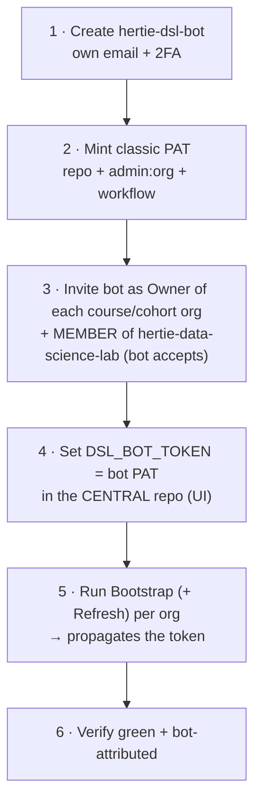

# Central admin - the DSL org

Who may provision course orgs, how to rotate the bot's token, how a toolkit change reaches
live orgs, and where to see which orgs exist.
Per-course access: [access-reference.md](../docs/reference/access-reference.md). PAT scopes and the token model:
[admin-setup.md](admin-setup.md).

## Granting a new instructor access

There is no config file for this. **Someone already in `hertie-data-science-lab` adds the new
person to one of its three provisioning teams via the GitHub Teams UI** - that is the only way
in, and it gates every central button.

| Team | Who | Toolkit repo |
|---|---|---|
| `faculty` | core DSL faculty | write |
| `instructors` | everyone else who teaches a DSL course | write |
| `admin` | maintainers of the toolkit itself | admin |

`faculty` and `instructors` are **access-identical**; the split records who someone is, not what
they may do. Everyone teaching a course is an instructor, and all faculty teach - but not every
instructor is core faculty, so a person belongs to exactly one of the two.

- **Bootstrap Course Org** checks membership of all three teams. No membership, no org
  provisioning.
- **Write is what makes the button clickable** - GitHub only shows *Run workflow* to users with
  write on the repo, and the `check-team` job is a second gate on top of that. Downgrading a
  team to read would silently remove its Bootstrap access, not just its push rights.
- The toolkit's `main` is **branch-protected** (changes go via PR).
- This authority is DSL-wide and *creation-only*. It grants **no** access to any course's own
  buttons - those come from that course org's `course-admin` / `instructors-<tag>` teams
  ([access-reference.md](../docs/reference/access-reference.md)).

## Bot lifecycle - setup & rotation

Every org holds its **own copy** of the bot's PAT (an org secret, plus repo secrets on private
repos on the Free plan), so rotating the token is a per-org operation, not one edit.

**Rotation:** mint a fresh PAT (2), set it in the central repo (4), re-run Bootstrap + Refresh
(5) **for every org** - a central edit alone changes nothing out there - verify (6), then
**revoke the previous PAT last**, only after *every* org verifies green under the new one. Set a
PAT expiry so rotation is forced.

The [nightly self-refresh](architecture.md#convergence--the-daily-self-refresh) does **not**
rotate anything: it runs *inside* each org under that org's own copy of the secret and simply
republishes it. Rotation is still a per-org Bootstrap run from central.

**Hard rules** (ordering is not optional):

- **Owner before token.** Invite the bot as Owner and have it accept (3) before propagating (5).
- **The bot must be a member of the central org.** Bootstrap's team gate reads
  `hertie-data-science-lab`'s teams **under `DSL_BOT_TOKEN`**; without that membership the gate
  **denies everyone**. Member is enough; it needn't be an owner there.
- **Swap central only after a one-org test.** Setting the central secret (4) doesn't touch
  existing org secrets, so it's safe - but prove it on one org before the rest.
- **Never paste a token into chat, PRs, or issues.** Set it *only* via the Secrets UI; a token
  exposed anywhere must be **revoked and reissued** immediately.

## Before bootstrapping a new org

- Create the org by hand in the GitHub web UI (there is no org-creation API).
- Invite the bot as an **Owner** and have it **accept** before Bootstrap runs - an unaccepted
  invite makes the run fail. Same for cohort orgs.
- Walkthroughs: [01-new-course-org.md](../docs/01-new-course-org.md) and
  [04-new-cohort-org.md](../docs/04-new-cohort-org.md).

## Email

Enrolment-code and grade emails go through `dsl_course.mailer` under a **tenant-level mail
credential** - a one-time central setup, not per course. `dry_run` previews need nothing.

- **Microsoft Graph (preferred)** - secrets `GRAPH_TENANT_ID`, `GRAPH_CLIENT_ID`,
  `GRAPH_CLIENT_SECRET`, `GRAPH_SENDER`. Needs an Entra app registration with the **Mail.Send**
  application permission, admin-consented, scoped to one shared mailbox (Exchange application
  access policy), plus that shared mailbox as the sender.
- **SMTP (fallback)** - `SMTP_HOST`, `SMTP_USER`, `SMTP_PASSWORD` (+ optional `SMTP_PORT`,
  `SMTP_FROM`). Most M365 tenants disable SMTP AUTH (error `5.7.139`), so Graph is usually the
  only viable route.

Set the secrets once; they must reach each course org's `.github` repo (where the send
workflows run). **Status: not yet configured in any DSL org** - a request to Hertie IT for the
Entra app registration is pending.

## Deploying the toolkit

Every seeded workflow in every org checks this repo out at run time, so whatever sits on the
ref an org runs **is** that org's engine. Three tiers, three branches:

| Tier | Branch | Runs on |
|---|---|---|
| dev | `main` | nobody - CI only. PRs squash-merge here exactly as before |
| staging | `staging` | the demo course org and its cohorts |
| release | `release` | every real org, and the default for one that declares nothing |

`staging` and `release` never carry commits of their own: both are always fast-forwards of
`main`. An org's tier is `central_ref:` in its **course** org's `.github/dsl-course.yml`;
cohorts inherit it. The [inventory page](../bootstrapped-orgs-inventory.md) shows it per
course org, and **Check cohort setup** shows it per cohort.

Neither tier branch exists until someone makes it, and `central.CENTRAL_REF` is already
`release`. **Order, on first setup:**

1. Merge to `main`.
2. Run **Promote** with `to: staging`, then `to: release`. The first run of each creates
   that branch from `main`.
3. Verify one org: open a workflow in its `.github` repo and check the checkout step's
   `ref:` is the tier you expect.

A refresh will not render a ref that is not there. `seed.refresh` checks the central repo
for it first, and if it is missing it logs the org and the ref, goes red, and **leaves the
org's existing workflows alone** - stale workflows that run beat current workflows that
cannot check anything out. So a forgotten tier branch costs a red cron, not an org whose
whole Actions tab (Refresh included) fails at checkout forever.

### Promote

Run **Promote** (Actions tab of this repo) with `to: staging`, then, once it has soaked,
`to: release`. `ref:` defaults to `main` for staging and `staging` for release; name a
commit to promote only that one.

Promote refuses anything that is not both on `main`'s history and a descendant of the tier's
current tip, so it can only ever move a tier forward - it cannot rewrite one, and cannot ship
what `main` has not seen. It then dispatches **Refresh actions** on every course org at that
tier, so they converge in minutes rather than at the next 05:27 cron.

Anyone with write on this repo can run it. Nothing else should push to either tier branch.

### Soak on staging

After promoting to `staging`, check the demo org (`hertie-dsl-demo-course-e1234` and
`hertie-dsl-demo-f2026`) before promoting on. A day covers one nightly refresh:

- [ ] **Refresh actions** green, both the Promote-triggered run and the next nightly cron
- [ ] one **Scheduled release** tick green (hourly; a dry run is enough if nothing is due)
- [ ] a **Join** issue with a deliberately wrong code is rejected as usual
- [ ] **Send enrolment codes** with `dry_run` previews codes and emails and sends nothing
- [ ] no failure issue opened in `hertie-dsl-demo-course-e1234/.github`

### Rollback

**The rule: revert on `main`, then promote the revert.**

1. `git revert <the bad commit>` on a branch, PR it, squash-merge to `main` as usual.
2. Run **Promote** with `to: release` and `ref: <the revert commit on main>` - promoting the
   branch tip would also ship everything else `main` has gathered since. Repeat for `staging`.

Every tier stays a fast-forward of `main`, so nothing is ever force-pushed and no org is
handed a history CI never ran. Promote cannot move a tier backwards by design: the only way
to undo something is a commit that says so.

**An org that already picked the bad build up** has nothing to undo - orgs keep no copy of
the engine, they check it out per run, so the next run uses the reverted code. The exception
is rendered workflow *shape* (inputs, jobs, crons), which is frozen in the org until its next
**Refresh actions**; Promote dispatches that, and any faculty member can re-run it by hand.

**Faster than a revert**, if one course is affected and a PR would take too long: set that
course org's `central_ref:` to the last known-good commit SHA and run **Refresh actions**.
One file edit, no review, and it moves only that course.

### Branch protection (set by hand)

On both `staging` and `release`:

- **Require linear history** - a tier is only ever a fast-forward.
- **Restrict who can push** to the GitHub Actions app: Promote's `GITHUB_TOKEN` should be the
  only thing that moves them.
- **Block force pushes** and **block deletions**. Promote passes `--force-with-lease` purely
  as a concurrency guard; every push it makes is a fast-forward, so the setting never blocks it.

`main` keeps what it has: PR only, `pytest` required.

### Putting an org on a tier

`central_ref:` is documented (commented out) in every course org's `.github/dsl-course.yml`.
To put the demo course on staging, set **`central_ref: staging`** in
`hertie-dsl-demo-course-e1234/.github/dsl-course.yml` and run **Refresh actions** in that org;
its cohorts follow. Valid values are `main`, `staging`, `release`, or a full 40-character
commit SHA - anything else is refused in the log and the org falls back to `release`. A new
org can be bootstrapped straight onto a tier with `bootstrap_course --central-ref`.

## What orgs exist

**[`bootstrapped-orgs-inventory.md`](../bootstrapped-orgs-inventory.md)** is the live list: two
tables, course orgs (topic `dsl-course`) and cohort orgs (topic `dsl-cohort`) mapped to the
course they point at, with any orphan sorted to the top. It is auto-generated **Mondays 06:00
UTC** (and on demand); when the list changed it opens a PR and merges it in the same run. Don't
hand-edit it - a missing org means a failed or never-run bootstrap, not a forgotten edit. The
refresh aborts rather than committing a net deletion (a truncated search page must not read as
"these orgs are gone").

## Related

- [admin-setup.md](admin-setup.md) - the bot account, exact PAT scopes, token/secret model.
- [access-reference.md](../docs/reference/access-reference.md) - per-course access and the instructors
  teams; [05 Manage the teaching team](../docs/05-manage-teaching-team.md) is the runbook for
  changing it.
- [architecture.md](architecture.md) - diagrams, workflow sequences, code map.
