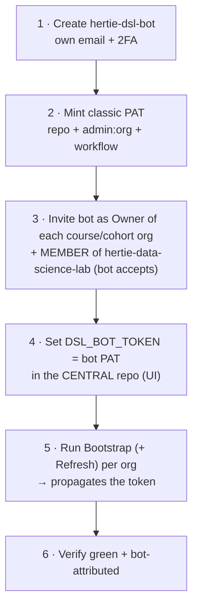

# Central admin - the DSL org

Who may provision course orgs, how to rotate the bot's token, and where to see which orgs exist.
Per-course access: [access-reference.md](../docs/reference/access-reference.md). PAT scopes and the token model:
[admin-setup.md](admin-setup.md).

## Granting a new instructor access

There is no config file for this. **Someone already in `hertie-data-science-lab` adds the new
person to one of its three provisioning teams via the GitHub Teams UI** - that is the only way
in, and it gates every central button.

| Team | Who | Toolkit repo |
|---|---|---|
| `faculty` | core DSL faculty | write |
| `instructors` | everyone else who teaches a DSL course | write |
| `admin` | maintainers of the toolkit itself | admin |

`faculty` and `instructors` are **access-identical**; the split records who someone is, not what
they may do. Everyone teaching a course is an instructor, and all faculty teach - but not every
instructor is core faculty, so a person belongs to exactly one of the two.

- **Bootstrap Course Org** checks membership of all three teams. No membership, no org
  provisioning.
- **Write is what makes the button clickable** - GitHub only shows *Run workflow* to users with
  write on the repo, and the `check-team` job is a second gate on top of that. Downgrading a
  team to read would silently remove its Bootstrap access, not just its push rights.
- The toolkit's `main` is **branch-protected** (changes go via PR).
- This authority is DSL-wide and *creation-only*. It grants **no** access to any course's own
  buttons - those come from that course org's `course-admin` / `instructors-<tag>` teams
  ([access-reference.md](../docs/reference/access-reference.md)).

## Bot lifecycle - setup & rotation

Every org holds its **own copy** of the bot's PAT (an org secret, plus repo secrets on private
repos on the Free plan), so rotating the token is a per-org operation, not one edit.

**Rotation:** mint a fresh PAT (2), set it in the central repo (4), re-run Bootstrap + Refresh
(5) **for every org** - a central edit alone changes nothing out there - verify (6), then
**revoke the previous PAT last**, only after *every* org verifies green under the new one. Set a
PAT expiry so rotation is forced.

The [nightly self-refresh](architecture.md#convergence--the-daily-self-refresh) does **not**
rotate anything: it runs *inside* each org under that org's own copy of the secret and simply
republishes it. Rotation is still a per-org Bootstrap run from central.

**Hard rules** (ordering is not optional):

- **Owner before token.** Invite the bot as Owner and have it accept (3) before propagating (5).
- **The bot must be a member of the central org.** Bootstrap's team gate reads
  `hertie-data-science-lab`'s teams **under `DSL_BOT_TOKEN`**; without that membership the gate
  **denies everyone**. Member is enough; it needn't be an owner there.
- **Swap central only after a one-org test.** Setting the central secret (4) doesn't touch
  existing org secrets, so it's safe - but prove it on one org before the rest.
- **Never paste a token into chat, PRs, or issues.** Set it *only* via the Secrets UI; a token
  exposed anywhere must be **revoked and reissued** immediately.

## Before bootstrapping a new org

- Create the org by hand in the GitHub web UI (there is no org-creation API).
- Invite the bot as an **Owner** and have it **accept** before Bootstrap runs - an unaccepted
  invite makes the run fail. Same for cohort orgs.
- Walkthroughs: [01-new-course-org.md](../docs/01-new-course-org.md) and
  [04-new-cohort-org.md](../docs/04-new-cohort-org.md).

## Email

Enrolment-code and grade emails go through `dsl_course.mailer` under a **tenant-level mail
credential** - a one-time central setup, not per course. `dry_run` previews need nothing.

- **Microsoft Graph (preferred)** - secrets `GRAPH_TENANT_ID`, `GRAPH_CLIENT_ID`,
  `GRAPH_CLIENT_SECRET`, `GRAPH_SENDER`. Needs an Entra app registration with the **Mail.Send**
  application permission, admin-consented, scoped to one shared mailbox (Exchange application
  access policy), plus that shared mailbox as the sender.
- **SMTP (fallback)** - `SMTP_HOST`, `SMTP_USER`, `SMTP_PASSWORD` (+ optional `SMTP_PORT`,
  `SMTP_FROM`). Most M365 tenants disable SMTP AUTH (error `5.7.139`), so Graph is usually the
  only viable route.

Set the secrets once in the **CENTRAL repo**; Bootstrap Course Org copies whichever are
configured onto the course org, scoped to `.github` (where the send workflows run), so
changing the mailbox is the same per-org re-run as a token rotation. **Status: not yet
configured in any DSL org** - a request to Hertie IT for the Entra app registration is
pending.

## What orgs exist

**[`bootstrapped-orgs-inventory.md`](../bootstrapped-orgs-inventory.md)** is the live list: two
tables, course orgs (topic `dsl-course`) and cohort orgs (topic `dsl-cohort`) mapped to the
course they point at, with any orphan sorted to the top. It is auto-generated **Mondays 06:00
UTC** (and on demand); when the list changed it opens a PR and merges it in the same run. Don't
hand-edit it - a missing org means a failed or never-run bootstrap, not a forgotten edit. The
refresh aborts rather than committing a net deletion (a truncated search page must not read as
"these orgs are gone").

## Related

- [admin-setup.md](admin-setup.md) - the bot account, exact PAT scopes, token/secret model.
- [access-reference.md](../docs/reference/access-reference.md) - per-course access and the instructors
  teams; [05 Manage the teaching team](../docs/05-manage-teaching-team.md) is the runbook for
  changing it.
- [architecture.md](architecture.md) - diagrams, workflow sequences, code map.
