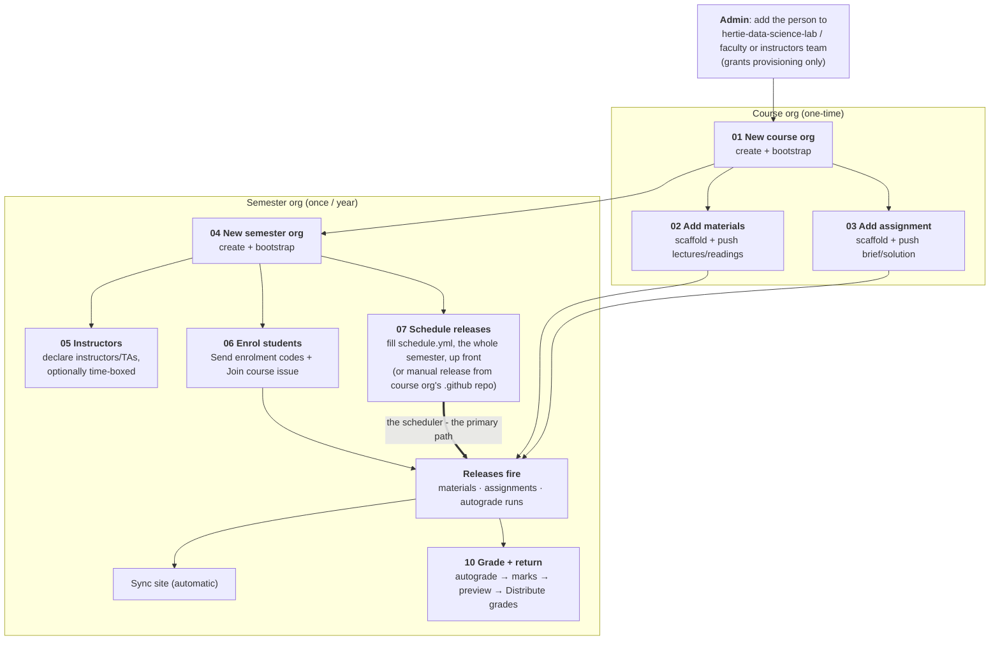

# Faculty & instructors workflows

Step-by-step runbooks for instructor-facing processes, end to end. 

## The two tiers

| Tier | Lives in | Lifetime | Holds |
|------|----------|----------|-------|
| **Course org** | `hertie-<course-slug>-<code>`, e.g. `hertie-dsl-demo-course-e1234` | persistent (all years) | materials, assignment templates, the faculty & instructors **control panel** (`.github`) |
| **Semester org** | `hertie-<course-slug>-<termtag>`, termtag `fYYYY`/`sYYYY`, e.g. `hertie-dsl-demo-f2026` | one per year | released materials, student repos, roster, the semester website |

The course org is the single source of truth (SSOT); each semester org receives **releases** of it.
Full model: [`../docs-admin-arch/architecture.md`](../docs-admin-arch/architecture.md).

## End-to-end path

> NB: filling in the semester org's `schedule.yml` up front automates the semester's material releases, assignment hand-outs and grading runs; the course org's `.github` workflows are there for ad hoc use.

## The workflows

Numbered in reading order - **course-level** (01-03) before **semester-level** (04-11):

| # | Workflow | Tier | When |
|---|----------|------|------|
| 01 | [New course org](01-new-course-org.md) | course | once, when a course first goes on the platform |
| 02 | [Add materials to course](02-add-materials-to-course.md) | course | per materials repo (usually once/year) |
| 03 | [Add assignment to course](03-add-assignment-to-course.md) | course | per assignment |
| 04 | [New semester org](04-new-cohort-org.md) | semester | once per year |
| 05 | [Manage the instructors](05-manage-teaching-team.md) | course + semester | whenever instructors join or leave - incl. **fixed-term** access for a TA or guest lecturer |
| 06 | [Enrol students to semester](06-enrol-students-to-cohort.md) | semester | start of each semester |
| 07 | [Schedule releases & deployed calendar](07-schedule-releases.md) | semester | once per semester, up front - **the primary release path** |
| 08 | [Manual release materials to semester](08-release-materials-to-cohort.md) | semester | fallback/ad-hoc release |
| 09 | [manual release assignment to semester](09-release-assignment-to-cohort.md) | semester | fallback/ad-hoc hand-out |
| 10 | [Grade and return assignments](10-grade-and-return-assignments.md) | semester | per assignment, after the deadline |
| 11 | [Configure the semester website](11-configure-cohort-site.md) | course + semester | whenever the site should say something different - and to know what not to hand-edit |

For a one-page summary of **every workflow**, see [`actions-reference.md`](reference/actions-reference.md);
for who may run them, [`access-reference.md`](reference/access-reference.md). If you maintain the
toolkit itself rather than a course, start at [`maintainers.md`](reference/maintainers.md); to
get a toolkit change out to live orgs, see
[Deploying the toolkit](../docs-admin-arch/central-admin.md#deploying-the-toolkit).

## Three things that look cosmetic and are not

- **The semester org's `fYYYY`/`sYYYY` suffix** is parsed: it picks the year's `instructors-<semester>`
  team and `*-<semester>` content repos. The course org's name is not validated.
- **Repo topics** (`dsl-course-hub`, `dsl-cohort`, `submission`, `gradebook`,
  `assignment-template`) are how discovery tells orgs and repos apart. Remove one by hand and
  the repo drops out of every sweep.
- **`.github/.system/last-refresh`** is a heartbeat: GitHub disables crons after 60 quiet days, so the
  nightly refresh commits a date. If it has stopped, run any workflow by hand to restart them.

## Example org artefacts

Every file these runbooks ask you to write exists, filled in, in
[`../example-course/`](../example-course/) - a complete worked dummy course you can copy
from:

| Runbook | Worked example |
|---------|----------------|
| [01](01-new-course-org.md) course identity, `course_admins`, instructor cards | [`course-org/dsl-course.yml`](../example-course/course-org/dsl-course.yml) |
| [02](02-add-materials-to-course.md) materials tree | [`course-materials-f2026/`](../example-course/course-org/course-materials-f2026/) - `lectures/`, `readings/`, `labs/`, `SYLLABUS.md` |
| [03](03-add-assignment-to-course.md) assignment `main/` + `solution/` | [`assignment-1`](../example-course/course-org/assignment-1-f2026/) (`.py`), [`assignment-2`](../example-course/course-org/assignment-2-f2026/) (notebook), [`assignment-4-project`](../example-course/course-org/assignment-4-project-f2026/) (**group**) - each with `grading_config.yml` + hidden `tests/` |
| [05](05-manage-teaching-team.md) the instructors, time-boxed | [`instructors.yml`](../example-course/cohort-org/instructors.yml) - two TAs with `start`/`end` dates |
| [06](06-enrol-students-to-cohort.md) roster + project teams | [`students.csv`](../example-course/cohort-org/students.csv) (incl. an auditor), [`teams.csv`](../example-course/cohort-org/teams.csv) |
| [07](07-schedule-releases.md) the whole semester's plan | [`schedule.yml`](../example-course/cohort-org/schedule.yml) - `releases` with `event_datetime`s + `deploy_datetime`s, `assignments` + `grading_datetime`, `events` (exams, a clinic) |
| [10](10-grade-and-return-assignments.md) grading sheets | [`grading_sheets/assignment-1.yml`](../example-course/cohort-org/grading_sheets/assignment-1.yml), [`grading_sheets/assignment-4-project.yml`](../example-course/cohort-org/grading_sheets/assignment-4-project.yml) (team marks) |
| [08](08-release-materials-to-cohort.md) a growing package | [`lecture-code-f2026/mlpkg/`](../example-course/course-org/lecture-code-f2026/) - disclosed subpackage by subpackage |

Field-by-field rules for all of these: [`DEPLOYMENT-CHECKLIST.md`](DEPLOYMENT-CHECKLIST.md).

## Demo orgs (live reference)

A standing demo you can inspect while reading - one course org, two semesters, running the
current engine:

- Course org: **[`hertie-dsl-demo-course-e1234`](https://github.com/hertie-dsl-demo-course-e1234)** 
- Semester org (current): **[`hertie-dsl-demo-f2026`](https://github.com/hertie-dsl-demo-f2026)** <- read here: the most filled out.
- Semester org (last year): **[`hertie-dsl-demo-f2025`](https://github.com/hertie-dsl-demo-f2025)**  <- an empty stub, showing how a finished semester stays attached to its course org.
