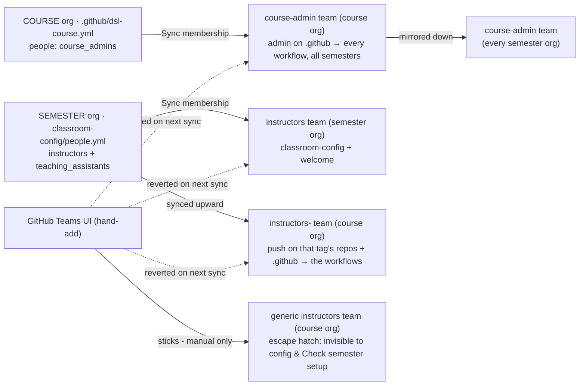

# Access reference

Who can do what, and which team grants it. The companion to
[`actions-reference.md`](actions-reference.md) (every workflow, one line each).

To **change** anyone's access, don't use this page - follow
[05 Manage the teaching team](../05-manage-teaching-team.md). Access is declared in config files and
reconciled; nothing here is clicked.

## Two separate populations

| | Who | Granted by | May do |
|---|---|---|---|
| **Provisioning** | DSL-wide | `faculty` / `instructors` / `admin` team in **`hertie-data-science-lab`** | run **Bootstrap Course Org** in the central repo. **Nothing else** - it grants no access inside any course. |
| **Running a course** | per course | that course org's `course-admin` or an `instructors-<tag>` team | every workflow in that course org's `.github` Actions tab |

A DSL faculty member who has never been declared in a course's config cannot push to it or
release anything there. Being a course admin, conversely, grants nothing centrally.

## Where each right is declared

| Right | Declared in | Level | Reaches |
|---|---|---|---|
| **Admin**, course-wide | course org `.github/dsl-course.yml` → `people:` `course_admins` (or the `admin` input at bootstrap) | **course** - once, for all years | `course-admin` team on the course org **and mirrored into every semester org** |
| **Push**, one year's content | that semester's `classroom-config/people.yml` → `instructors` / `teaching_assistants` | **semester** - per year | semester org `instructors` team + course org `instructors-<tag>` team |
| **Read** on released materials | `classroom-config/students.csv` | semester | `students` or `auditors` team (`role` column) |
| **Write** on a shared project repo | `classroom-config/teams.csv` | semester | `<assignment>-<team>` team |

`course_admins` is deliberately **course-level**: a course director should not be re-declared each
year, and their admin rights need to span every semester. Instructors and TAs are deliberately
**semester-level**: they change most years, so each semester's list stands alone with no merge across
years and no accumulate-forever roster.

Both files' person entries accept optional `start` / `end` ISO dates - see
[time-boxed access](../05-manage-teaching-team.md#time-box-it-start--end).

## What `course-admin` grants

Membership of **that course org's own `course-admin` team** makes **every** workflow in that org's
Actions tab visible and runnable, across all its semesters. The team is mirrored into each of the
course's semester orgs, where it holds **admin on every repo** - not ownership of the org itself.
It is scoped to **one course**.

Cron-driven runs (**Scheduled release**, and the automatic paths of **Sync site** /
**Sync membership** / **Publish course website**) skip the access gate entirely - a scheduled run
has no actor to check.

> **Publish course website:** `actual-readings` mode hosts the reading files publicly. Only
> publish what you hold the rights to share - use `reading-list` for copyrighted readings.

## What `instructors-<tag>` reaches

Push on:

- the course org's **`.github`** - which is what makes the central workflows visible and runnable
  for them; and
- every course-org repo whose **name ends `-<tag>`**: `course-materials-f2026`,
  `assignment-1-f2026`, `lecture-code-f2026`.

So a TA on `f2026` can push labs into `course-materials-f2026` and release them to the semester
without any further grant - the release itself runs server-side as the bot.

The suffix match is the whole rule. A course-org repo **without** the year tag in its name is not
covered; name per-year content repos `<thing>-<tag>`, or grant that repo by hand. A repo scaffolded
by **New materials repo** / **New assignment** is granted **as it is created**, not on some later
sync.

Semester-side, the same people get write on `classroom-config` and `welcome`.

## What faculty hold on each repo

Two teams carry every faculty grant: `instructors` (this org's teaching team) and `course-admin`.

| Repo | `instructors` | `course-admin` |
|---|---|---|
| course org - **every** repo, `.github` included | push | admin |
| semester `.github`, `welcome`, `classroom-config` | push | admin |
| semester released materials | push | admin |
| semester submission repos (incl. `<slug>-submissions`), `grades-<handle>` | **read** | admin |

Push on released materials, because a release now lands on the repo's `upstream` branch and is
**merged** into the branch students read - so a correction typed into the semester's copy survives
the next release instead of being overwritten by it. The course org is still the source of truth:
carry the fix back with **Propagate semester edits**, or next year's semester starts from the
uncorrected version.

Read on what a semester *receives* per person: marks live in
`classroom-config/grading_sheets/<slug>.yml` (**Distribute grades** rewrites gradebooks from it),
so an edit in the received copy would silently vanish. `.github` keeps push because GitHub
requires write to trigger a `workflow_dispatch`.

Grants are set at repo creation; the nightly **Refresh actions** sweep raises any repo below its
floor and never demotes.

A `visibility: public` assignment changes who may READ a submission repo and nothing else: the
floor is computed off the repo's NAME, so `instructors` still hold **read** and never push on a
student's work, and the student still holds `maintain` on their own.

A `submit_via: shared_dropbox_repo` assignment hands out ONE repo, `<slug>-submissions`, and every
onboarded student (or every vetted team) holds **push** on it - the whole semester's work in
one place, readable by all of them, which is what the shape is for. The faculty floor is
unchanged: the name derives from the assignment's semester template, so the same rule that
recognises `<slug>-<handle>` recognises this, and `instructors` hold **read**. The repo
carries a ruleset forbidding force-pushes and deletion - but rulesets on a private repo need
GitHub Team, and every Hertie org is on Free until the Education upgrade lands, so until then
the drop box is left unprotected and the release run log says so.

Push on that one repo CONVERGES on the roster, which no other submission repo needs to: the
drop box holds the whole semester's work, so a grant left behind is somebody who has left the
course able to overwrite everybody else's. Every tick grants whoever is missing and revokes
every direct grant belonging to nobody on the enrolled, onboarded roster - including one added
by hand. Team grants, the faculty teams and the bot are never touched: they reach the repo
through a team or by owning the org, and the sweep only ever reads and revokes DIRECT
collaborators. A listing that could not be read revokes nothing.

A `visibility: student_choice` assignment changes the STUDENT's grant and nothing else: they
hold **admin** on their own repo (or their team does, on a group one) so that they can publish
it after the grading cutoff. The faculty floor is unchanged - still read, never push, on a
student's work - and the floor never demotes the student either, so the admin grant stands for
the life of the semester.

## The four `instructors` teams

Four different teams share the word "instructors" - they are not interchangeable. The first names
a *population* (who teaches at DSL); the other three name a *role in one course*:

| Team | Lives in | Declared by | Grants |
| --- | --- | --- | --- |
| `instructors` | **`hertie-data-science-lab`** | nothing - manual | write on the toolkit → run **Bootstrap Course Org**. No access inside any course. |
| `instructors` | a **semester** org | that semester's `classroom-config/people.yml` | semester-org membership for that year's instructors/TAs; reconciled |
| `instructors-<tag>` | the **course** org | the same `people.yml` (tag = e.g. `f2026`) | push on `.github` + that tag's content repos, i.e. the workflows for that semester; reconciled |
| `instructors` | the **course** org (generic) | nothing - manual | a rare, permanent escape hatch |

The central one is the odd kind out: it is the only one that grants **provisioning** and the only
one that reaches nothing inside a course. See
[central-admin.md](../../docs-admin-arch/central-admin.md).

The generic course-org `instructors` team is the other exception: a manual add sticks until manually
removed, but it is **invisible to every config file and to Check semester setup**. Use it sparingly and
record who's on it elsewhere. Route FA (faculty assistant) and TA access through `people.yml`.

## Rules that catch people out

- **Hand-added members get reverted.** Adding someone to `course-admin`, a semester's `instructors`
  team or `instructors-<tag>` through the GitHub Teams UI survives only until the next Sync
  membership run, which removes anyone the config doesn't name. A hand-*removal* is likewise
  re-added. Edit the file.
- **Students hold `maintain` on their own submission repo** - or `push` on the one
  `<slug>-submissions` drop box, where the assignment has one - and read on their own
  `grades-<handle>`; nowhere else, so no faculty workflow is visible or runnable for them.
  `maintain` does not include changing a repo's visibility, so a `public` assignment's repos
  are public because the assignment said so and stay that way. The one exception is
  `visibility: student_choice`, where the grant is **admin** precisely so that the student can
  change it - bounded by the org's own Member privileges settings and by the scheduler, which
  re-privatises such a repo until the grading cutoff ([03](../03-add-assignment-to-course.md)).
- **New members must accept a one-time org invite** - membership shows `pending` until they do.
- **Nobody ever holds the bot token.** Every workflow runs server-side under `DSL_BOT_TOKEN`; the
  actor's own permissions are only ever used as the gate.
- **This is rotation, not a security boundary.** `instructors-<tag>` has push on `.github`, and no
  branch protection is configured, so a member could edit `dsl-course.yml` to add themselves to
  `course_admins`, or extend their own `end` date in `classroom-config`. Fine for trusted teaching
  staff; if you need a hard boundary, protect `main` on `.github` and `classroom-config`.

## Where to look when access seems wrong

**Check semester setup** (course `.github` → Actions, pick the semester) is read-only and prints a per-semester
checklist - identity, people, schedule + release plan, roster, teams, grades - with an edit link
for each gap. Start there. The **Sync membership** run log then lists every add and removal it
made.

## Related

- [05 Manage the teaching team](../05-manage-teaching-team.md) - the runbook for changing any of this.
- [`DEPLOYMENT-CHECKLIST.md`](../DEPLOYMENT-CHECKLIST.md) - field-by-field schemas for `dsl-course.yml`
  and `people.yml`.
- [`../../docs-admin-arch/central-admin.md`](../../docs-admin-arch/central-admin.md) - central DSL-org
  authority: who can create orgs, the bot and its rotation, the org inventory.
- [`../../docs-admin-arch/admin-setup.md`](../../docs-admin-arch/admin-setup.md) - the bot account, its
  PAT scopes, and the token model.
- [`../../docs-admin-arch/architecture.md`](../../docs-admin-arch/architecture.md) - how the pieces move.
